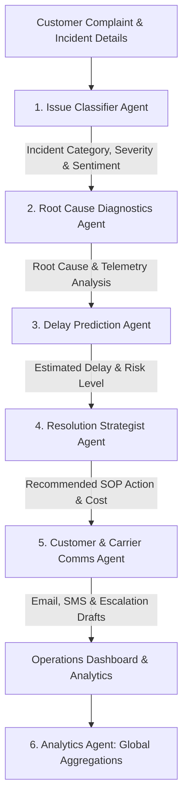

# 📦 Smart Delivery Intelligence System (SDIS)

[](https://www.python.org/)
[](https://streamlit.io/)
[](https://deepmind.google/technologies/gemini/)
[](https://docs.pytest.org/)

An automated, **Multi-Agent incident management workstation** and **operations dashboard** designed to resolve logistics disruptions in e-commerce workflows. SDIS utilizes a sequence of specialized AI agents built with **Google Gemini 2.5 Flash** and rule-based fallback heuristics to process customer complaints, inspect tracking scans, diagnose transit issues, predict delays, recommend SOP actions, and generate professional correspondence.

---

## 🔍 Problem Statement

In modern e-commerce and retail logistics, shipping delays and delivery failures are inevitable due to weather disruptions, carrier operational errors, customs holds, and incorrect address metadata. 

For logistics operators, resolving these incidents manually is highly inefficient:
* **Data Silos**: Operators must manually correlate customer complaints with internal transit scan logs, external weather telemetry, and carrier performance tables.
* **Decision Latency**: Determining the optimal financial resolution (e.g., immediate refund vs. priority reshipping) requires calculating order values, delay lengths, and SLA breaches under strict company standard operating procedures (SOPs).
* **Communication Bottlenecks**: Manually drafting personalized emails, SMS updates, and carrier escalation tickets leads to slower resolution times and lower customer satisfaction.

---

## 💡 Solution Overview

The **Smart Delivery Intelligence System (SDIS)** resolves these pain points by orchestrating an automated, multi-agent AI pipeline. 



When an operator selects or inputs a delivery incident, SDIS runs **six specialized agents** in a deterministic downstream cascade, passing a mutable *shared context*. The result is an action-ready resolution panel displaying estimated delay times, financial decisions, pre-drafted emails/SMS messages, and a real-time analytics dashboard to track logistics health.

---

## ✨ Features

* **⚡ Orchestrated Multi-Agent Pipeline**: Executes 5 sequential agents + 1 aggregation agent to handle end-to-end incident resolution.
* **📈 Operations Control Center**: Streamlit-based UI displaying real-time shipment metadata, route telemetry, and chronological transit scan histories.
* **💰 SOP-Driven Resolution Engine**: Recommends optimized business decisions (Refund, Priority Reshipment, Address Validation Hold) based on order values, delay thresholds, and SLA risks.
* **✉️ Multi-Channel Communication Drafts**: Auto-generates personalized HTML emails and SMS messages for customers, alongside structured carrier escalation tickets.
* **📊 SLA Performance & Cost Analytics**: Interactive dashboard compiling total processed incidents, SLA compliance rates, average resolution costs, and active warnings using **Plotly**.
* **🔌 Dual Execution Modes**:
  * **Live Gemini Mode**: Harnesses the `google-genai` SDK and `gemini-2.5-flash` in JSON Mode for structured intelligence.
  * **Offline Mock Mode**: Instantly executes high-fidelity heuristic calculations for offline demonstrations without API keys or latency.

---

## 🤖 Multi-Agent Architecture

SDIS implements a modular agent design. Each agent is responsible for a single logical component of the pipeline:

| Agent Name | Primary Function | Code Location | System Prompt |
| :--- | :--- | :--- | :--- |
| **1. Issue Classifier** | Parses unstructured customer complaints into category, severity, and customer sentiment. | [`agents/issue_classifier.py`](file:///c:/Users/sowmy/OneDrive/Desktop/capstone/agents/issue_classifier.py) | [`prompts/issue_prompt.py`](file:///c:/Users/sowmy/OneDrive/Desktop/capstone/prompts/issue_prompt.py) |
| **2. Root Cause Diagnostics** | Correlates transit scan logs with weather telemetry to determine the source of disruption. | [`agents/root_cause_agent.py`](file:///c:/Users/sowmy/OneDrive/Desktop/capstone/agents/root_cause_agent.py) | [`prompts/rootcause_prompt.py`](file:///c:/Users/sowmy/OneDrive/Desktop/capstone/prompts/rootcause_prompt.py) |
| **3. Delay Prediction** | Forecasts estimated delay hours and identifies risk factors using historical corridor speeds. | [`agents/delay_prediction_agent.py`](file:///c:/Users/sowmy/OneDrive/Desktop/capstone/agents/delay_prediction_agent.py) | Heuristics / Local Rules |
| **4. Resolution Strategist** | Maps incident metrics and order value to standard operating procedures to recommend the cheapest, compliant resolution. | [`agents/resolution_agent.py`](file:///c:/Users/sowmy/OneDrive/Desktop/capstone/agents/resolution_agent.py) | [`prompts/resolution_prompt.py`](file:///c:/Users/sowmy/OneDrive/Desktop/capstone/prompts/resolution_prompt.py) |
| **5. Customer & Carrier Comms** | Drafts customized, polite customer email and SMS notifications and formal carrier escalations. | [`agents/communication_agent.py`](file:///c:/Users/sowmy/OneDrive/Desktop/capstone/agents/communication_agent.py) | [`prompts/communication_prompt.py`](file:///c:/Users/sowmy/OneDrive/Desktop/capstone/prompts/communication_prompt.py) |
| **6. Analytics Compiler** | Aggregates cumulative historical incident records and computes KPIs for dashboard plotting. | [`agents/analytics_agent.py`](file:///c:/Users/sowmy/OneDrive/Desktop/capstone/agents/analytics_agent.py) | Heuristics / Plotly Engines |

---

## 📂 Folder Structure

```text
capstone/
├── agents/                      # Python files containing core agent business logic
│   ├── __init__.py              # Shared logs configurations
│   ├── analytics_agent.py       # Metrics aggregator and Plotly serializer
│   ├── communication_agent.py   # Correspondence generation agent
│   ├── delay_prediction_agent.py# Transit delay forecasting model
│   ├── issue_classifier.py      # Natural language understanding processor
│   ├── resolution_agent.py      # SOP financial decision strategist
│   └── root_cause_agent.py      # Multi-source log forensic correlator
├── prompts/                     # Structured markdown prompt specifications for LLMs
│   ├── communication_prompt.py
│   ├── issue_prompt.py
│   ├── resolution_prompt.py
│   └── rootcause_prompt.py
├── data/                        # Analytical database mock files
│   └── mock_shipments.json      # Structured historical shipment log inputs
├── tests/                       # Test suite validating pipeline schema integrity
│   └── test_agents.py           # Unit tests checking heuristic outputs
├── screenshots/                 # Captured dashboard visual mockups
│   ├── Screenshot 2026-06-23 155603.png
│   ├── Screenshot 2026-06-23 155618.png
│   ├── Screenshot 2026-06-23 160103.png
│   └── Screenshot 2026-06-23 160118.png
├── app.py                       # Premium Streamlit UI entry point
├── project.md                   # Detailed architecture specifications
├── requirements.txt             # Project library dependencies
└── README.md                    # System documentation (This file)
```

---

## 🛠️ Technologies Used

* **Frontend**: Streamlit, HTML5, Premium CSS variables, Custom Google Fonts (Outfit).
* **Programming**: Python 3.10+.
* **Data Processing**: Pandas, NumPy.
* **Visualization**: Plotly Express, Plotly Graph Objects.
* **Large Language Models**: Google GenAI SDK (`google-genai`), Gemini 2.5 Flash API.
* **Testing**: Pytest.

---

## ⚙️ Installation Instructions

Follow these instructions to set up SDIS locally on your system:

### 1. Clone the Repository
```bash
git clone <repository_url>
cd capstone
```

### 2. Configure Virtual Environment
Create and activate a virtual environment to isolate the project dependencies:
```bash
# Create venv
python -m venv venv

# Activate on Windows (PowerShell)
.\venv\Scripts\Activate.ps1

# Activate on Windows (Command Prompt)
venv\Scripts\activate.bat

# Activate on macOS/Linux
source venv/bin/activate
```

### 3. Install Package Dependencies
Install the required packages listed in `requirements.txt`:
```bash
pip install -r requirements.txt
```

---

## 🚀 How to Run the Application

### 1. Run Verification Checks
Verify that all schemas and agent heuristic routines function properly before launching the server:
```bash
pytest tests/test_agents.py
```

### 2. Launch the Streamlit Dashboard
Execute the dashboard interface locally:
```bash
streamlit run app.py
```
After launching, your terminal will provide a local address. The application typically opens automatically in your default browser at:
👉 **[http://localhost:8501](http://localhost:8501)**

> [!TIP]
> **To activate Live Gemini Mode**: Paste your **Gemini API Key** in the input field located in the left sidebar. Leave it blank to keep the system in high-fidelity **Offline Mock Mode**.

---

## 📸 Screenshots

Here is a visual overview of the Smart Delivery Intelligence System:

### 1. Incident Workstation Dashboard
Displays the shipment context, route status, weather severity telemetry, and tracking history alongside the customer complaint card.


### 2. Multi-Agent Pipeline Output
Visualizes the downstream output logs of each agent in the sequence as they process the incident context.


### 3. Resolution Summary & Drafted Correspondence
Presents actionable financial metrics, SLA breach warning checks, and drafts for customer emails, SMS, and carrier escalation logs.


### 4. Global SLA Performance & Cost Analytics
Interactive analytics pane plotting issue distributions, carrier compliance comparisons, and a search table of resolved incidents.


---

## 🚀 Future Improvements

* **🔗 Live Carrier Integration**: Connect directly with shipping carrier webhooks (FedEx, DHL, UPS) to poll real-time transit telemetry dynamically.
* **🖼️ Multimodal Proof-of-Damage**: Enable customers to upload photos of damaged packaging, processed by Gemini's multimodal vision system to instantly rate package condition.
* **🧠 Active Human-in-the-Loop Tuning**: Implement a log system that captures modifications made by operators to email drafts and financial resolutions to refine agent prompts over time.
* **🛡️ Enterprise Access Control**: Add user authentication, role-based access levels, and secure database backends for multi-operator workspaces.

---

## 👥 Author Information

* **Author**: Capstone Engineering Team
* **Contact**: support@sdis-logistics.ai
* **Repository**: [Smart Delivery Intelligence System](https://github.com/)
